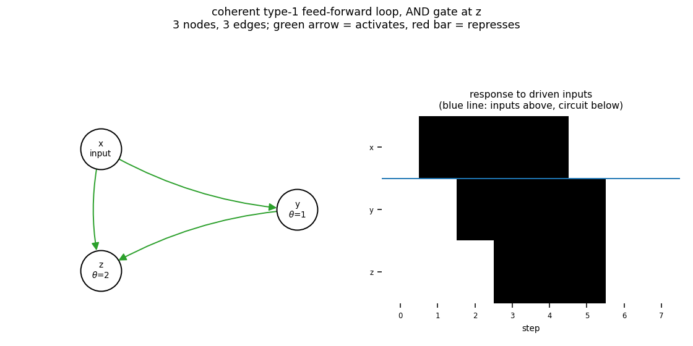

# ffl_c1_and

coherent type-1 feed-forward loop, AND gate at z

3 nodes, 3 edges. Every function is a symmetric threshold function: it fires when at least `threshold` of its signed inputs agree (a `+` input agreeing means it is on, a `-` input agreeing means it is off).

Feed-forward, so the dynamics are not the point: held inputs settle the circuit into a fixed point within a few steps, and all 2 attractors are fixed points - one per input pattern (1 input node(s): x).

## Functions

| node | function | threshold |
|---|---|---|
| `x` | `input` | 0 |
| `y` | `x` | 1 |
| `z` | `x AND y` | 2 |

## Truth table

| x | y | z |
|---|---|---|
| 0 | 0 | 0 |
| 1 | 1 | 1 |

