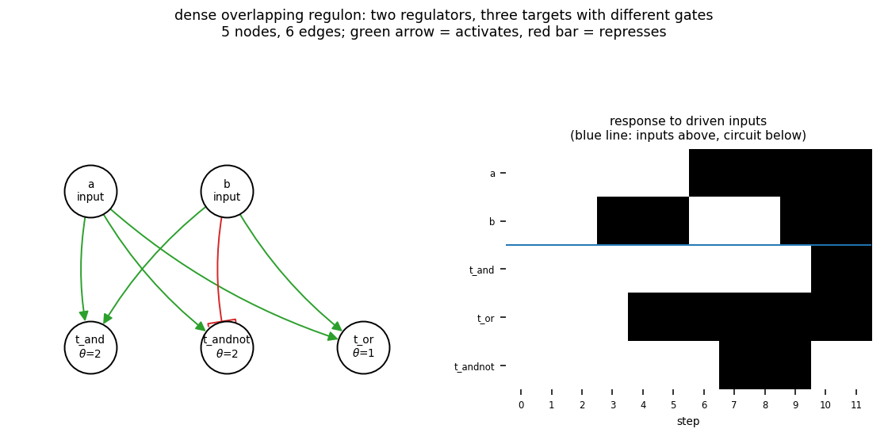

# gate_dor

dense overlapping regulon: two regulators, three targets with different gates

5 nodes, 6 edges. Every function is a symmetric threshold function: it fires when at least `threshold` of its signed inputs agree (a `+` input agreeing means it is on, a `-` input agreeing means it is off).

Feed-forward, so the dynamics are not the point: held inputs settle the circuit into a fixed point within a few steps, and all 4 attractors are fixed points - one per input pattern (2 input node(s): a, b).

## Functions

| node | function | threshold |
|---|---|---|
| `a` | `input` | 0 |
| `b` | `input` | 0 |
| `t_and` | `a AND b` | 2 |
| `t_or` | `a OR b` | 1 |
| `t_andnot` | `a AND NOT b` | 2 |

## Truth table

| a | b | t_and | t_or | t_andnot |
|---|---|---|---|---|
| 0 | 0 | 0 | 0 | 0 |
| 0 | 1 | 0 | 1 | 0 |
| 1 | 0 | 0 | 1 | 1 |
| 1 | 1 | 1 | 1 | 0 |

