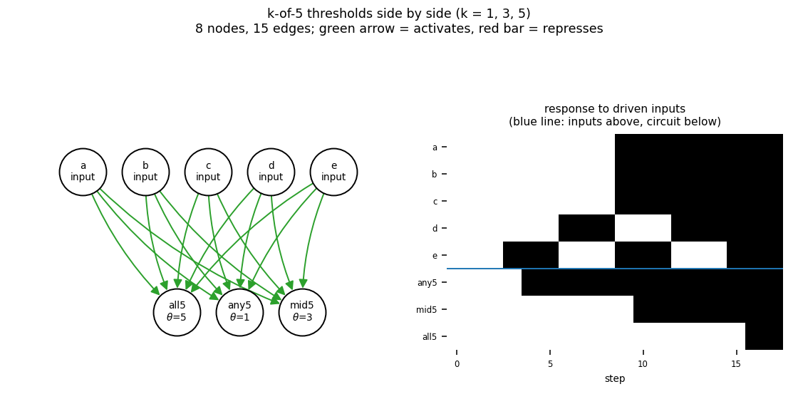

# gate_k_of_5

k-of-5 thresholds side by side (k = 1, 3, 5)

8 nodes, 15 edges. Every function is a symmetric threshold function: it fires when at least `threshold` of its signed inputs agree (a `+` input agreeing means it is on, a `-` input agreeing means it is off).

Feed-forward, so the dynamics are not the point: held inputs settle the circuit into a fixed point within a few steps, and all 32 attractors are fixed points - one per input pattern (5 input node(s): a, b, c, d, e).

## Functions

| node | function | threshold |
|---|---|---|
| `a` | `input` | 0 |
| `b` | `input` | 0 |
| `c` | `input` | 0 |
| `d` | `input` | 0 |
| `e` | `input` | 0 |
| `any5` | `at least 1 of (a, b, c, d, e)` | 1 |
| `mid5` | `at least 3 of (a, b, c, d, e)` | 3 |
| `all5` | `at least 5 of (a, b, c, d, e)` | 5 |

## Truth table

| a | b | c | d | e | any5 | mid5 | all5 |
|---|---|---|---|---|---|---|---|
| 0 | 0 | 0 | 0 | 0 | 0 | 0 | 0 |
| 0 | 0 | 0 | 0 | 1 | 1 | 0 | 0 |
| 0 | 0 | 0 | 1 | 0 | 1 | 0 | 0 |
| 0 | 0 | 0 | 1 | 1 | 1 | 0 | 0 |
| 0 | 0 | 1 | 0 | 0 | 1 | 0 | 0 |
| 0 | 0 | 1 | 0 | 1 | 1 | 0 | 0 |
| 0 | 0 | 1 | 1 | 0 | 1 | 0 | 0 |
| 0 | 0 | 1 | 1 | 1 | 1 | 1 | 0 |
| 0 | 1 | 0 | 0 | 0 | 1 | 0 | 0 |
| 0 | 1 | 0 | 0 | 1 | 1 | 0 | 0 |
| 0 | 1 | 0 | 1 | 0 | 1 | 0 | 0 |
| 0 | 1 | 0 | 1 | 1 | 1 | 1 | 0 |
| 0 | 1 | 1 | 0 | 0 | 1 | 0 | 0 |
| 0 | 1 | 1 | 0 | 1 | 1 | 1 | 0 |
| 0 | 1 | 1 | 1 | 0 | 1 | 1 | 0 |
| 0 | 1 | 1 | 1 | 1 | 1 | 1 | 0 |
| ... | ... |

(first 16 of 32 input patterns)

