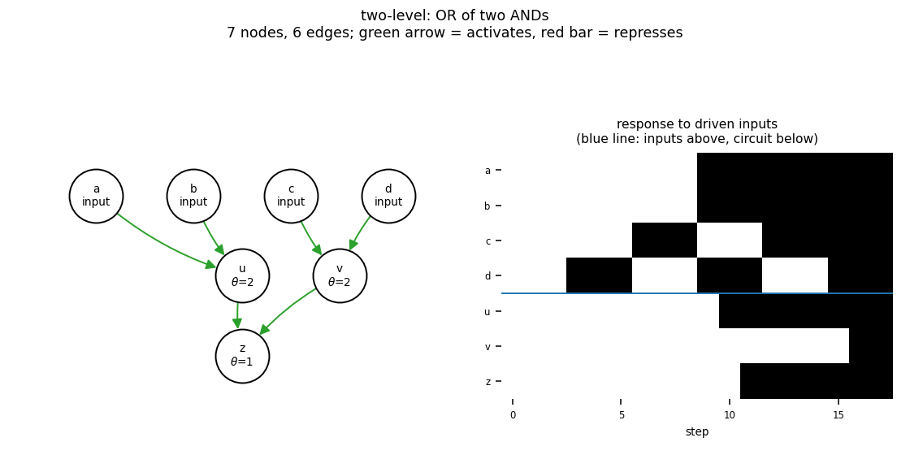

# gate_or_of_and

two-level: OR of two ANDs

7 nodes, 6 edges. Every function is a symmetric threshold function: it fires when at least `threshold` of its signed inputs agree (a `+` input agreeing means it is on, a `-` input agreeing means it is off).

Feed-forward, so the dynamics are not the point: held inputs settle the circuit into a fixed point within a few steps, and all 16 attractors are fixed points - one per input pattern (4 input node(s): a, b, c, d).

## Functions

| node | function | threshold |
|---|---|---|
| `a` | `input` | 0 |
| `b` | `input` | 0 |
| `c` | `input` | 0 |
| `d` | `input` | 0 |
| `u` | `a AND b` | 2 |
| `v` | `c AND d` | 2 |
| `z` | `u OR v` | 1 |

## Truth table

| a | b | c | d | u | v | z |
|---|---|---|---|---|---|---|
| 0 | 0 | 0 | 0 | 0 | 0 | 0 |
| 0 | 0 | 0 | 1 | 0 | 0 | 0 |
| 0 | 0 | 1 | 0 | 0 | 0 | 0 |
| 0 | 0 | 1 | 1 | 0 | 1 | 1 |
| 0 | 1 | 0 | 0 | 0 | 0 | 0 |
| 0 | 1 | 0 | 1 | 0 | 0 | 0 |
| 0 | 1 | 1 | 0 | 0 | 0 | 0 |
| 0 | 1 | 1 | 1 | 0 | 1 | 1 |
| 1 | 0 | 0 | 0 | 0 | 0 | 0 |
| 1 | 0 | 0 | 1 | 0 | 0 | 0 |
| 1 | 0 | 1 | 0 | 0 | 0 | 0 |
| 1 | 0 | 1 | 1 | 0 | 1 | 1 |
| 1 | 1 | 0 | 0 | 1 | 0 | 1 |
| 1 | 1 | 0 | 1 | 1 | 0 | 1 |
| 1 | 1 | 1 | 0 | 1 | 0 | 1 |
| 1 | 1 | 1 | 1 | 1 | 1 | 1 |

