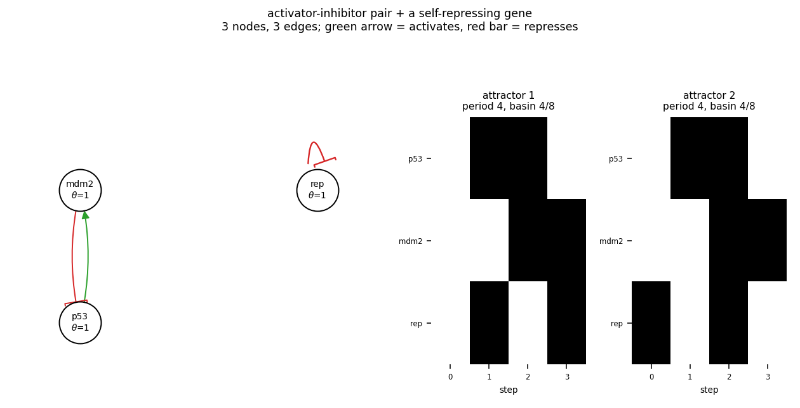

# size03_ai_nar

activator-inhibitor pair + a self-repressing gene

3 nodes, 3 edges. Every function is a symmetric threshold function: it fires when at least `threshold` of its signed inputs agree (a `+` input agreeing means it is on, a `-` input agreeing means it is off).

## Functions

| node | function | threshold |
|---|---|---|
| `p53` | `NOT mdm2` | 1 |
| `mdm2` | `p53` | 1 |
| `rep` | `NOT rep` | 1 |

## State space

All 8 states enumerated: 2 attractors (0 of them fixed points), mean 2.00 nodes change per step along them.

| attractor | period | basin | states (p53, mdm2, rep) |
|---|---|---|---|
| 1 | 4 | 4/8 | 000 -> 101 -> 110 -> 011 |
| 2 | 4 | 4/8 | 001 -> 100 -> 111 -> 010 |

