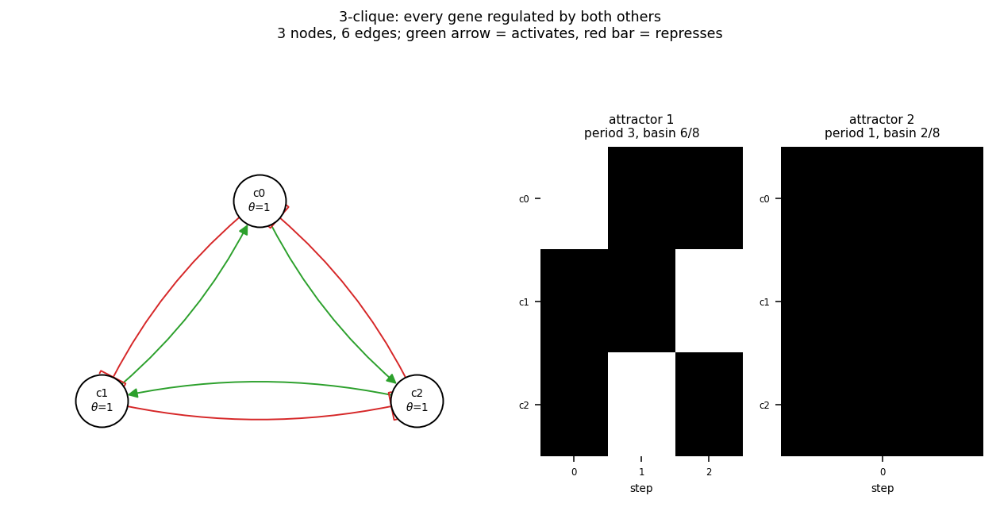

# size03_clique3

3-clique: every gene regulated by both others

3 nodes, 6 edges. Every function is a symmetric threshold function: it fires when at least `threshold` of its signed inputs agree (a `+` input agreeing means it is on, a `-` input agreeing means it is off).

## Functions

| node | function | threshold |
|---|---|---|
| `c0` | `c1 OR NOT c2` | 1 |
| `c1` | `c2 OR NOT c0` | 1 |
| `c2` | `c0 OR NOT c1` | 1 |

## State space

All 8 states enumerated: 2 attractors (1 of them fixed points), mean 1.50 nodes change per step along them.

| attractor | period | basin | states (c0, c1, c2) |
|---|---|---|---|
| 1 | 3 | 6/8 | 011 -> 110 -> 101 |
| 2 | 1 | 2/8 | 111 |

