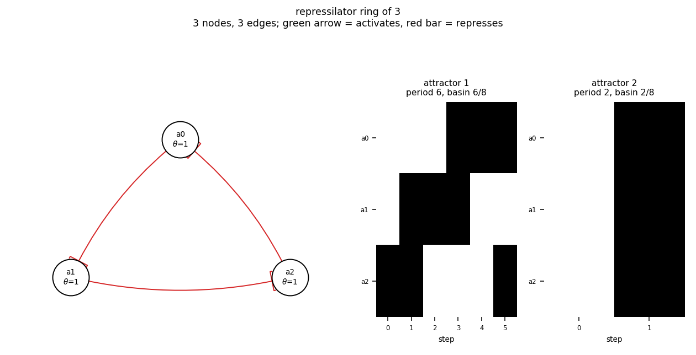

# size03_ring3

repressilator ring of 3

3 nodes, 3 edges. Every function is a symmetric threshold function: it fires when at least `threshold` of its signed inputs agree (a `+` input agreeing means it is on, a `-` input agreeing means it is off).

## Functions

| node | function | threshold |
|---|---|---|
| `a0` | `NOT a2` | 1 |
| `a1` | `NOT a0` | 1 |
| `a2` | `NOT a1` | 1 |

## State space

All 8 states enumerated: 2 attractors (0 of them fixed points), mean 1.50 nodes change per step along them.

| attractor | period | basin | states (a0, a1, a2) |
|---|---|---|---|
| 1 | 6 | 6/8 | 001 -> 011 -> 010 -> 110 -> 100 -> 101 |
| 2 | 2 | 2/8 | 000 -> 111 |

