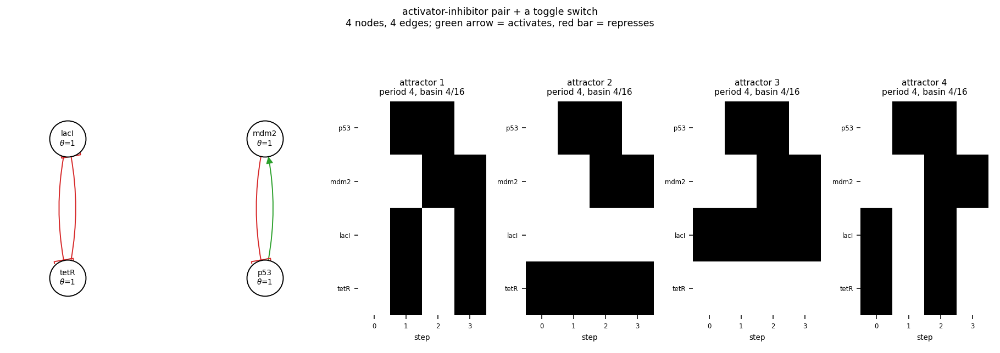

# size04_ai_toggle

activator-inhibitor pair + a toggle switch

4 nodes, 4 edges. Every function is a symmetric threshold function: it fires when at least `threshold` of its signed inputs agree (a `+` input agreeing means it is on, a `-` input agreeing means it is off).

## Functions

| node | function | threshold |
|---|---|---|
| `p53` | `NOT mdm2` | 1 |
| `mdm2` | `p53` | 1 |
| `lacI` | `NOT tetR` | 1 |
| `tetR` | `NOT lacI` | 1 |

## State space

All 16 states enumerated: 4 attractors (0 of them fixed points), mean 2.00 nodes change per step along them.

| attractor | period | basin | states (p53, mdm2, lacI, tetR) |
|---|---|---|---|
| 1 | 4 | 4/16 | 0000 -> 1011 -> 1100 -> 0111 |
| 2 | 4 | 4/16 | 0001 -> 1001 -> 1101 -> 0101 |
| 3 | 4 | 4/16 | 0010 -> 1010 -> 1110 -> 0110 |
| 4 | 4 | 4/16 | 0011 -> 1000 -> 1111 -> 0100 |

