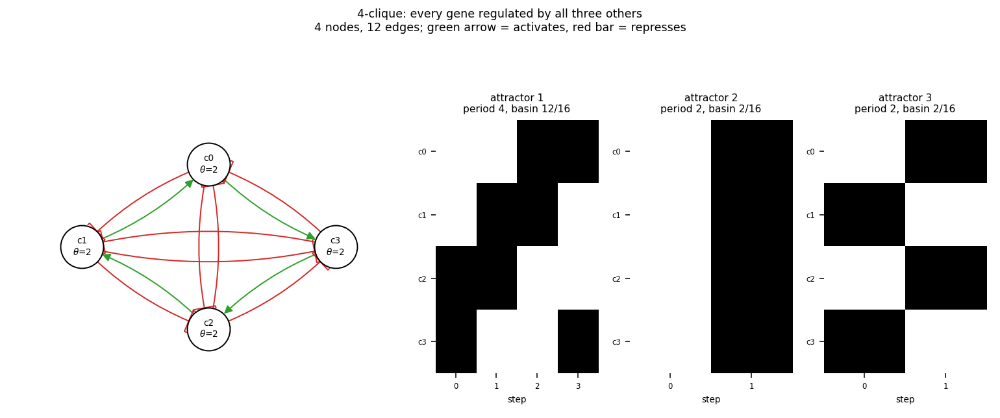

# size04_clique4

4-clique: every gene regulated by all three others

4 nodes, 12 edges. Every function is a symmetric threshold function: it fires when at least `threshold` of its signed inputs agree (a `+` input agreeing means it is on, a `-` input agreeing means it is off).

## Functions

| node | function | threshold |
|---|---|---|
| `c0` | `at least 2 of (c1, NOT c2, NOT c3)` | 2 |
| `c1` | `at least 2 of (c2, NOT c3, NOT c0)` | 2 |
| `c2` | `at least 2 of (c3, NOT c0, NOT c1)` | 2 |
| `c3` | `at least 2 of (c0, NOT c1, NOT c2)` | 2 |

## State space

All 16 states enumerated: 3 attractors (0 of them fixed points), mean 3.00 nodes change per step along them.

| attractor | period | basin | states (c0, c1, c2, c3) |
|---|---|---|---|
| 1 | 4 | 12/16 | 0011 -> 0110 -> 1100 -> 1001 |
| 2 | 2 | 2/16 | 0000 -> 1111 |
| 3 | 2 | 2/16 | 0101 -> 1010 |

