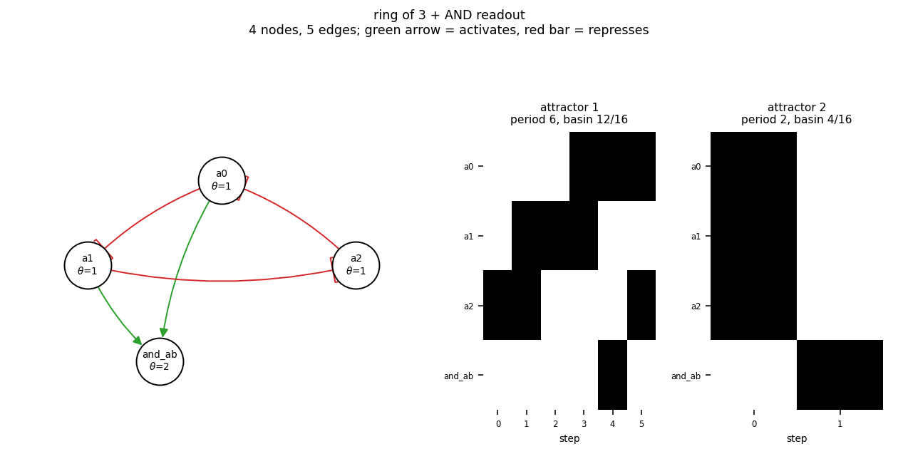

# size04_ring3_and

ring of 3 + AND readout

4 nodes, 5 edges. Every function is a symmetric threshold function: it fires when at least `threshold` of its signed inputs agree (a `+` input agreeing means it is on, a `-` input agreeing means it is off).

## Functions

| node | function | threshold |
|---|---|---|
| `a0` | `NOT a2` | 1 |
| `a1` | `NOT a0` | 1 |
| `a2` | `NOT a1` | 1 |
| `and_ab` | `a0 AND a1` | 2 |

## State space

All 16 states enumerated: 2 attractors (0 of them fixed points), mean 2.00 nodes change per step along them.

| attractor | period | basin | states (a0, a1, a2, and_ab) |
|---|---|---|---|
| 1 | 6 | 12/16 | 0010 -> 0110 -> 0100 -> 1100 -> 1001 -> 1010 |
| 2 | 2 | 4/16 | 1110 -> 0001 |

