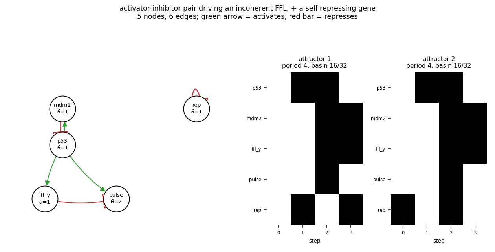

# size05_ai_i1ffl_nar

activator-inhibitor pair driving an incoherent FFL, + a self-repressing gene

5 nodes, 6 edges. Every function is a symmetric threshold function: it fires when at least `threshold` of its signed inputs agree (a `+` input agreeing means it is on, a `-` input agreeing means it is off).

## Functions

| node | function | threshold |
|---|---|---|
| `p53` | `NOT mdm2` | 1 |
| `mdm2` | `p53` | 1 |
| `ffl_y` | `p53` | 1 |
| `pulse` | `p53 AND NOT ffl_y` | 2 |
| `rep` | `NOT rep` | 1 |

## State space

All 32 states enumerated: 2 attractors (0 of them fixed points), mean 3.00 nodes change per step along them.

| attractor | period | basin | states (p53, mdm2, ffl_y, pulse, rep) |
|---|---|---|---|
| 1 | 4 | 16/32 | 00000 -> 10001 -> 11110 -> 01101 |
| 2 | 4 | 16/32 | 00001 -> 10000 -> 11111 -> 01100 |

