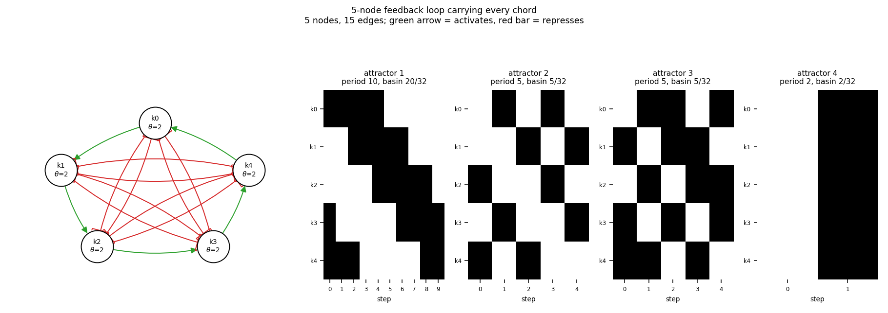

# size05_chorded_loop5

5-node feedback loop carrying every chord

5 nodes, 15 edges. Every function is a symmetric threshold function: it fires when at least `threshold` of its signed inputs agree (a `+` input agreeing means it is on, a `-` input agreeing means it is off).

## Functions

| node | function | threshold |
|---|---|---|
| `k0` | `at least 2 of (k4, NOT k3, NOT k2)` | 2 |
| `k1` | `at least 2 of (k0, NOT k4, NOT k3)` | 2 |
| `k2` | `at least 2 of (k1, NOT k0, NOT k4)` | 2 |
| `k3` | `at least 2 of (k2, NOT k1, NOT k0)` | 2 |
| `k4` | `at least 2 of (k3, NOT k2, NOT k1)` | 2 |

## State space

All 32 states enumerated: 4 attractors (0 of them fixed points), mean 2.73 nodes change per step along them.

| attractor | period | basin | states (k0, k1, k2, k3, k4) |
|---|---|---|---|
| 1 | 10 | 20/32 | 10011 -> 10001 -> 11001 -> 11000 -> 11100 -> 01100 -> 01110 -> 00110 -> 00111 -> 00011 |
| 2 | 5 | 5/32 | 00101 -> 10010 -> 01001 -> 10100 -> 01010 |
| 3 | 5 | 5/32 | 01011 -> 10101 -> 11010 -> 01101 -> 10110 |
| 4 | 2 | 2/32 | 00000 -> 11111 |

