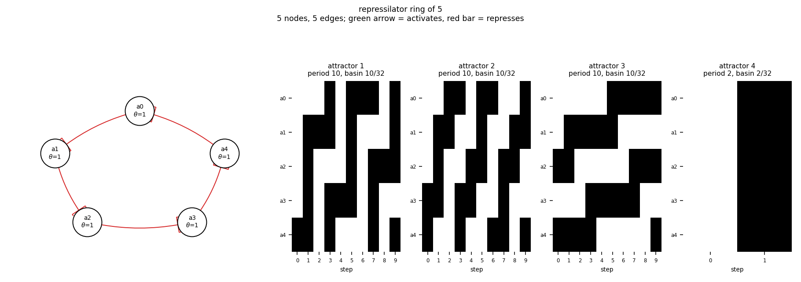

# size05_ring5

repressilator ring of 5

5 nodes, 5 edges. Every function is a symmetric threshold function: it fires when at least `threshold` of its signed inputs agree (a `+` input agreeing means it is on, a `-` input agreeing means it is off).

## Functions

| node | function | threshold |
|---|---|---|
| `a0` | `NOT a4` | 1 |
| `a1` | `NOT a0` | 1 |
| `a2` | `NOT a1` | 1 |
| `a3` | `NOT a2` | 1 |
| `a4` | `NOT a3` | 1 |

## State space

All 32 states enumerated: 4 attractors (0 of them fixed points), mean 2.50 nodes change per step along them.

| attractor | period | basin | states (a0, a1, a2, a3, a4) |
|---|---|---|---|
| 1 | 10 | 10/32 | 00001 -> 01111 -> 01000 -> 11011 -> 00010 -> 11110 -> 10000 -> 10111 -> 00100 -> 11101 |
| 2 | 10 | 10/32 | 00011 -> 01110 -> 11000 -> 10011 -> 00110 -> 11100 -> 10001 -> 00111 -> 01100 -> 11001 |
| 3 | 10 | 10/32 | 00101 -> 01101 -> 01001 -> 01011 -> 01010 -> 11010 -> 10010 -> 10110 -> 10100 -> 10101 |
| 4 | 2 | 2/32 | 00000 -> 11111 |

