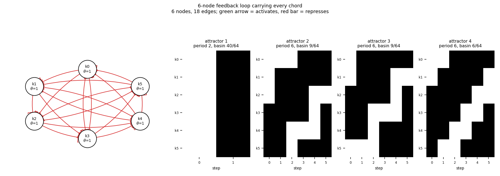

# size06_chorded_loop6

6-node feedback loop carrying every chord

6 nodes, 18 edges. Every function is a symmetric threshold function: it fires when at least `threshold` of its signed inputs agree (a `+` input agreeing means it is on, a `-` input agreeing means it is off).

## Functions

| node | function | threshold |
|---|---|---|
| `k0` | `NOT k5 OR NOT k4 OR NOT k3` | 1 |
| `k1` | `NOT k0 OR NOT k5 OR NOT k4` | 1 |
| `k2` | `NOT k1 OR NOT k0 OR NOT k5` | 1 |
| `k3` | `NOT k2 OR NOT k1 OR NOT k0` | 1 |
| `k4` | `NOT k3 OR NOT k2 OR NOT k1` | 1 |
| `k5` | `NOT k4 OR NOT k3 OR NOT k2` | 1 |

## State space

All 64 states enumerated: 4 attractors (0 of them fixed points), mean 2.40 nodes change per step along them.

| attractor | period | basin | states (k0, k1, k2, k3, k4, k5) |
|---|---|---|---|
| 1 | 2 | 40/64 | 000000 -> 111111 |
| 2 | 6 | 9/64 | 000111 -> 011111 -> 011100 -> 111101 -> 110001 -> 110111 |
| 3 | 6 | 9/64 | 001110 -> 111110 -> 111000 -> 111011 -> 100011 -> 101111 |
| 4 | 6 | 6/64 | 001111 -> 011110 -> 111100 -> 111001 -> 110011 -> 100111 |

