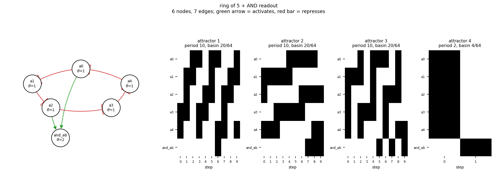

# size06_ring5_and

ring of 5 + AND readout

6 nodes, 7 edges. Every function is a symmetric threshold function: it fires when at least `threshold` of its signed inputs agree (a `+` input agreeing means it is on, a `-` input agreeing means it is off).

## Functions

| node | function | threshold |
|---|---|---|
| `a0` | `NOT a4` | 1 |
| `a1` | `NOT a0` | 1 |
| `a2` | `NOT a1` | 1 |
| `a3` | `NOT a2` | 1 |
| `a4` | `NOT a3` | 1 |
| `and_ab` | `a0 AND a2` | 2 |

## State space

All 64 states enumerated: 4 attractors (0 of them fixed points), mean 2.88 nodes change per step along them.

| attractor | period | basin | states (a0, a1, a2, a3, a4, and_ab) |
|---|---|---|---|
| 1 | 10 | 20/64 | 000110 -> 011100 -> 110000 -> 100110 -> 001100 -> 111000 -> 100011 -> 001110 -> 011000 -> 110010 |
| 2 | 10 | 20/64 | 011010 -> 010010 -> 010110 -> 010100 -> 110100 -> 100100 -> 101100 -> 101001 -> 101011 -> 001011 |
| 3 | 10 | 20/64 | 011110 -> 010000 -> 110110 -> 000100 -> 111100 -> 100001 -> 101110 -> 001001 -> 111010 -> 000011 |
| 4 | 2 | 4/64 | 111110 -> 000001 |

