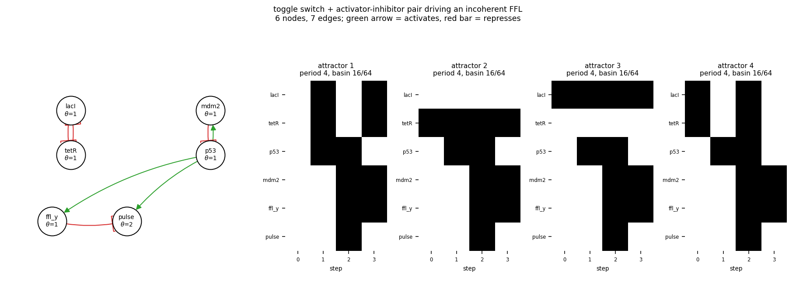

# size06_toggle_ai_i1ffl

toggle switch + activator-inhibitor pair driving an incoherent FFL

6 nodes, 7 edges. Every function is a symmetric threshold function: it fires when at least `threshold` of its signed inputs agree (a `+` input agreeing means it is on, a `-` input agreeing means it is off).

## Functions

| node | function | threshold |
|---|---|---|
| `lacI` | `NOT tetR` | 1 |
| `tetR` | `NOT lacI` | 1 |
| `p53` | `NOT mdm2` | 1 |
| `mdm2` | `p53` | 1 |
| `ffl_y` | `p53` | 1 |
| `pulse` | `p53 AND NOT ffl_y` | 2 |

## State space

All 64 states enumerated: 4 attractors (0 of them fixed points), mean 3.00 nodes change per step along them.

| attractor | period | basin | states (lacI, tetR, p53, mdm2, ffl_y, pulse) |
|---|---|---|---|
| 1 | 4 | 16/64 | 000000 -> 111000 -> 001111 -> 110110 |
| 2 | 4 | 16/64 | 010000 -> 011000 -> 011111 -> 010110 |
| 3 | 4 | 16/64 | 100000 -> 101000 -> 101111 -> 100110 |
| 4 | 4 | 16/64 | 110000 -> 001000 -> 111111 -> 000110 |

