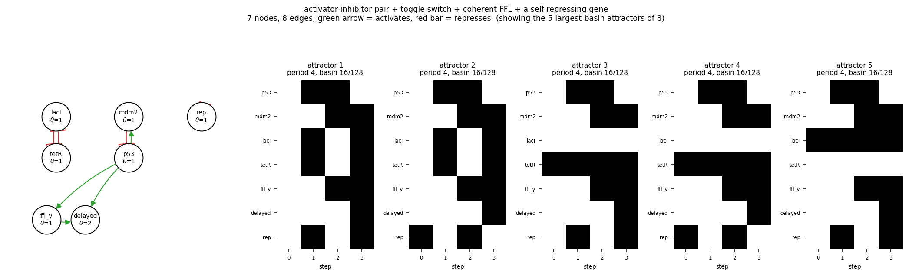

# size07_ai_toggle_c1ffl_nar

activator-inhibitor pair + toggle switch + coherent FFL + a self-repressing gene

7 nodes, 8 edges. Every function is a symmetric threshold function: it fires when at least `threshold` of its signed inputs agree (a `+` input agreeing means it is on, a `-` input agreeing means it is off).

## Functions

| node | function | threshold |
|---|---|---|
| `p53` | `NOT mdm2` | 1 |
| `mdm2` | `p53` | 1 |
| `lacI` | `NOT tetR` | 1 |
| `tetR` | `NOT lacI` | 1 |
| `ffl_y` | `p53` | 1 |
| `delayed` | `p53 AND ffl_y` | 2 |
| `rep` | `NOT rep` | 1 |

## State space

All 128 states enumerated: 8 attractors (0 of them fixed points), mean 4.00 nodes change per step along them.

| attractor | period | basin | states (p53, mdm2, lacI, tetR, ffl_y, delayed, rep) |
|---|---|---|---|
| 1 | 4 | 16/128 | 0000000 -> 1011001 -> 1100100 -> 0111111 |
| 2 | 4 | 16/128 | 0000001 -> 1011000 -> 1100101 -> 0111110 |
| 3 | 4 | 16/128 | 0001000 -> 1001001 -> 1101100 -> 0101111 |
| 4 | 4 | 16/128 | 0001001 -> 1001000 -> 1101101 -> 0101110 |
| 5 | 4 | 16/128 | 0010000 -> 1010001 -> 1110100 -> 0110111 |
| 6 | 4 | 16/128 | 0010001 -> 1010000 -> 1110101 -> 0110110 |
| 7 | 4 | 16/128 | 0011000 -> 1000001 -> 1111100 -> 0100111 |
| 8 | 4 | 16/128 | 0011001 -> 1000000 -> 1111101 -> 0100110 |

