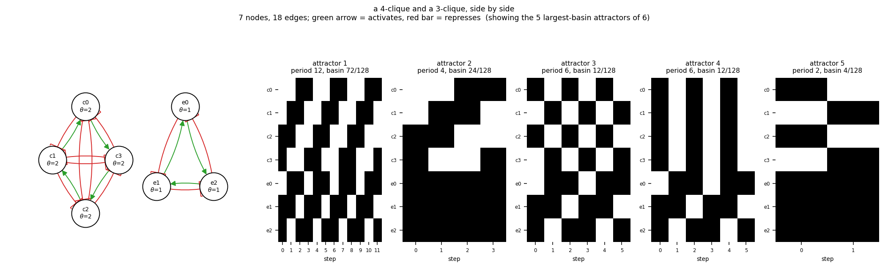

# size07_clique4_clique3

a 4-clique and a 3-clique, side by side

7 nodes, 18 edges. Every function is a symmetric threshold function: it fires when at least `threshold` of its signed inputs agree (a `+` input agreeing means it is on, a `-` input agreeing means it is off).

## Functions

| node | function | threshold |
|---|---|---|
| `c0` | `at least 2 of (c1, NOT c2, NOT c3)` | 2 |
| `c1` | `at least 2 of (c2, NOT c3, NOT c0)` | 2 |
| `c2` | `at least 2 of (c3, NOT c0, NOT c1)` | 2 |
| `c3` | `at least 2 of (c0, NOT c1, NOT c2)` | 2 |
| `e0` | `e1 OR NOT e2` | 1 |
| `e1` | `e2 OR NOT e0` | 1 |
| `e2` | `e0 OR NOT e1` | 1 |

## State space

All 128 states enumerated: 6 attractors (0 of them fixed points), mean 4.50 nodes change per step along them.

| attractor | period | basin | states (c0, c1, c2, c3, e0, e1, e2) |
|---|---|---|---|
| 1 | 12 | 72/128 | 0011011 -> 0110110 -> 1100101 -> 1001011 -> 0011110 -> 0110101 -> 1100011 -> 1001110 -> 0011101 -> 0110011 -> ... |
| 2 | 4 | 24/128 | 0011111 -> 0110111 -> 1100111 -> 1001111 |
| 3 | 6 | 12/128 | 1010011 -> 0101110 -> 1010101 -> 0101011 -> 1010110 -> 0101101 |
| 4 | 6 | 12/128 | 1111011 -> 0000110 -> 1111101 -> 0000011 -> 1111110 -> 0000101 |
| 5 | 2 | 4/128 | 1010111 -> 0101111 |
| 6 | 2 | 4/128 | 1111111 -> 0000111 |

