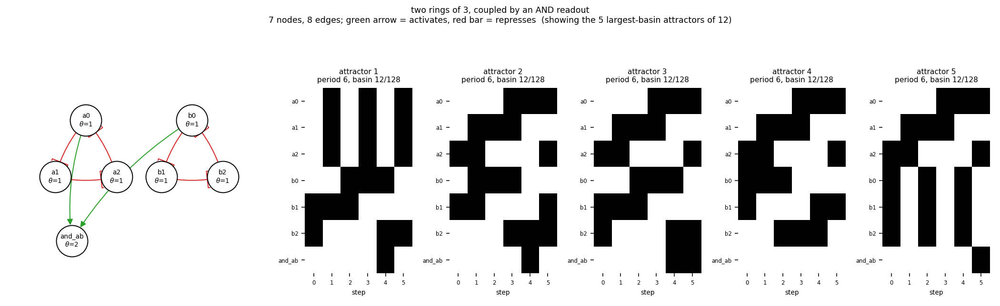

# size07_two_ring3_and

two rings of 3, coupled by an AND readout

7 nodes, 8 edges. Every function is a symmetric threshold function: it fires when at least `threshold` of its signed inputs agree (a `+` input agreeing means it is on, a `-` input agreeing means it is off).

## Functions

| node | function | threshold |
|---|---|---|
| `a0` | `NOT a2` | 1 |
| `a1` | `NOT a0` | 1 |
| `a2` | `NOT a1` | 1 |
| `b0` | `NOT b2` | 1 |
| `b1` | `NOT b0` | 1 |
| `b2` | `NOT b1` | 1 |
| `and_ab` | `a0 AND b0` | 2 |

## State space

All 128 states enumerated: 12 attractors (0 of them fixed points), mean 3.38 nodes change per step along them.

| attractor | period | basin | states (a0, a1, a2, b0, b1, b2, and_ab) |
|---|---|---|---|
| 1 | 6 | 12/128 | 0000110 -> 1110100 -> 0001100 -> 1111000 -> 0001011 -> 1110010 |
| 2 | 6 | 12/128 | 0010100 -> 0111100 -> 0101000 -> 1101010 -> 1000011 -> 1010110 |
| 3 | 6 | 12/128 | 0010110 -> 0110100 -> 0101100 -> 1101000 -> 1001011 -> 1010011 |
| 4 | 6 | 12/128 | 0011100 -> 0111000 -> 0101010 -> 1100010 -> 1000110 -> 1010100 |
| 5 | 6 | 12/128 | 0011110 -> 0110000 -> 0101110 -> 1100000 -> 1001110 -> 1010001 |
| 6 | 6 | 12/128 | 0110010 -> 0100110 -> 1100100 -> 1001100 -> 1011001 -> 0011011 |
| 7 | 6 | 12/128 | 0110110 -> 0100100 -> 1101100 -> 1001001 -> 1011011 -> 0010011 |
| 8 | 6 | 12/128 | 0111010 -> 0100010 -> 1100110 -> 1000100 -> 1011100 -> 0011001 |
| 9 | 6 | 12/128 | 0111110 -> 0100000 -> 1101110 -> 1000001 -> 1011110 -> 0010001 |
| 10 | 6 | 12/128 | 1110110 -> 0000100 -> 1111100 -> 0001001 -> 1111010 -> 0000011 |
| 11 | 2 | 4/128 | 0001110 -> 1110000 |
| 12 | 2 | 4/128 | 1111110 -> 0000001 |

