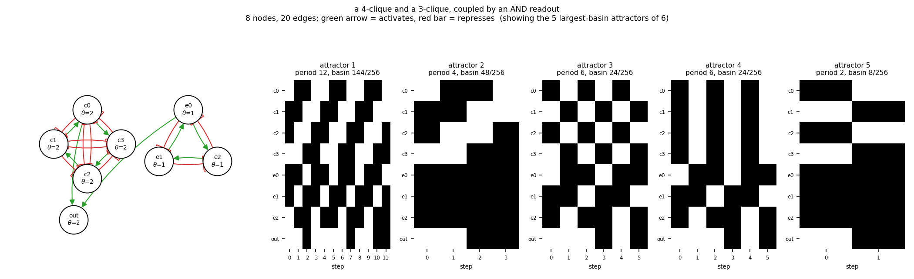

# size08_clique4_clique3_readout

a 4-clique and a 3-clique, coupled by an AND readout

8 nodes, 20 edges. Every function is a symmetric threshold function: it fires when at least `threshold` of its signed inputs agree (a `+` input agreeing means it is on, a `-` input agreeing means it is off).

## Functions

| node | function | threshold |
|---|---|---|
| `c0` | `at least 2 of (c1, NOT c2, NOT c3)` | 2 |
| `c1` | `at least 2 of (c2, NOT c3, NOT c0)` | 2 |
| `c2` | `at least 2 of (c3, NOT c0, NOT c1)` | 2 |
| `c3` | `at least 2 of (c0, NOT c1, NOT c2)` | 2 |
| `e0` | `e1 OR NOT e2` | 1 |
| `e1` | `e2 OR NOT e0` | 1 |
| `e2` | `e0 OR NOT e1` | 1 |
| `out` | `c0 AND e0` | 2 |

## State space

All 256 states enumerated: 6 attractors (0 of them fixed points), mean 5.12 nodes change per step along them.

| attractor | period | basin | states (c0, c1, c2, c3, e0, e1, e2, out) |
|---|---|---|---|
| 1 | 12 | 144/256 | 01101100 -> 11001010 -> 10010111 -> 00111100 -> 01101010 -> 11000110 -> 10011100 -> 00111011 -> 01100110 -> 11001100 -> ... |
| 2 | 4 | 48/256 | 01101110 -> 11001110 -> 10011111 -> 00111111 |
| 3 | 6 | 24/256 | 10100110 -> 01011100 -> 10101010 -> 01010111 -> 10101100 -> 01011011 |
| 4 | 6 | 24/256 | 11110110 -> 00001100 -> 11111010 -> 00000111 -> 11111100 -> 00001011 |
| 5 | 2 | 8/256 | 10101110 -> 01011111 |
| 6 | 2 | 8/256 | 11111110 -> 00001111 |

