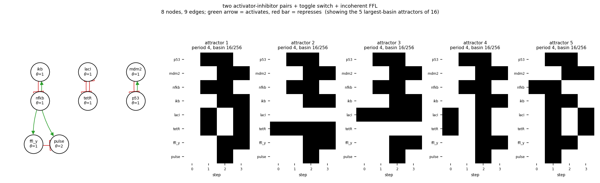

# size08_two_ai_toggle_i1ffl

two activator-inhibitor pairs + toggle switch + incoherent FFL

8 nodes, 9 edges. Every function is a symmetric threshold function: it fires when at least `threshold` of its signed inputs agree (a `+` input agreeing means it is on, a `-` input agreeing means it is off).

## Functions

| node | function | threshold |
|---|---|---|
| `p53` | `NOT mdm2` | 1 |
| `mdm2` | `p53` | 1 |
| `nfkb` | `NOT ikb` | 1 |
| `ikb` | `nfkb` | 1 |
| `lacI` | `NOT tetR` | 1 |
| `tetR` | `NOT lacI` | 1 |
| `ffl_y` | `nfkb` | 1 |
| `pulse` | `nfkb AND NOT ffl_y` | 2 |

## State space

All 256 states enumerated: 16 attractors (0 of them fixed points), mean 4.00 nodes change per step along them.

| attractor | period | basin | states (p53, mdm2, nfkb, ikb, lacI, tetR, ffl_y, pulse) |
|---|---|---|---|
| 1 | 4 | 16/256 | 00000000 -> 10101100 -> 11110011 -> 01011110 |
| 2 | 4 | 16/256 | 00000100 -> 10100100 -> 11110111 -> 01010110 |
| 3 | 4 | 16/256 | 00001000 -> 10101000 -> 11111011 -> 01011010 |
| 4 | 4 | 16/256 | 00001100 -> 10100000 -> 11111111 -> 01010010 |
| 5 | 4 | 16/256 | 00100000 -> 10111111 -> 11010010 -> 01001100 |
| 6 | 4 | 16/256 | 00100100 -> 10110111 -> 11010110 -> 01000100 |
| 7 | 4 | 16/256 | 00101000 -> 10111011 -> 11011010 -> 01001000 |
| 8 | 4 | 16/256 | 00101100 -> 10110011 -> 11011110 -> 01000000 |
| 9 | 4 | 16/256 | 10000000 -> 11101100 -> 01110011 -> 00011110 |
| 10 | 4 | 16/256 | 10000100 -> 11100100 -> 01110111 -> 00010110 |
| 11 | 4 | 16/256 | 10001000 -> 11101000 -> 01111011 -> 00011010 |
| 12 | 4 | 16/256 | 10001100 -> 11100000 -> 01111111 -> 00010010 |
| 13 | 4 | 16/256 | 11000000 -> 01101100 -> 00110011 -> 10011110 |
| 14 | 4 | 16/256 | 11000100 -> 01100100 -> 00110111 -> 10010110 |
| 15 | 4 | 16/256 | 11001000 -> 01101000 -> 00111011 -> 10011010 |
| 16 | 4 | 16/256 | 11001100 -> 01100000 -> 00111111 -> 10010010 |

