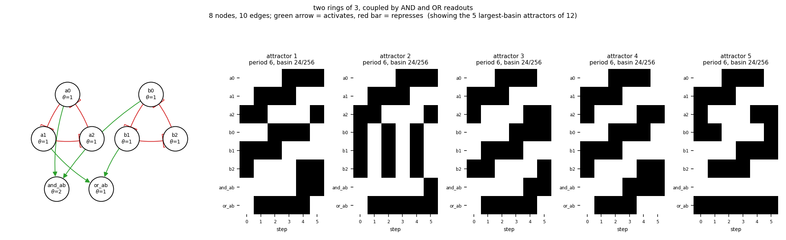

# size08_two_ring3_and_or

two rings of 3, coupled by AND and OR readouts

8 nodes, 10 edges. Every function is a symmetric threshold function: it fires when at least `threshold` of its signed inputs agree (a `+` input agreeing means it is on, a `-` input agreeing means it is off).

## Functions

| node | function | threshold |
|---|---|---|
| `a0` | `NOT a2` | 1 |
| `a1` | `NOT a0` | 1 |
| `a2` | `NOT a1` | 1 |
| `b0` | `NOT b2` | 1 |
| `b1` | `NOT b0` | 1 |
| `b2` | `NOT b1` | 1 |
| `and_ab` | `a0 AND b0` | 2 |
| `or_ab` | `a1 OR b1` | 1 |

## State space

All 256 states enumerated: 12 attractors (0 of them fixed points), mean 3.75 nodes change per step along them.

| attractor | period | basin | states (a0, a1, a2, b0, b1, b2, and_ab, or_ab) |
|---|---|---|---|
| 1 | 6 | 24/256 | 00101100 -> 01101001 -> 01011001 -> 11010001 -> 10010111 -> 10100110 |
| 2 | 6 | 24/256 | 00111100 -> 01100001 -> 01011101 -> 11000001 -> 10011101 -> 10100011 |
| 3 | 6 | 24/256 | 01100100 -> 01001101 -> 11001001 -> 10011001 -> 10110011 -> 00110110 |
| 4 | 6 | 24/256 | 01101100 -> 01001001 -> 11011001 -> 10010011 -> 10110110 -> 00100110 |
| 5 | 6 | 24/256 | 01110001 -> 01010101 -> 11000101 -> 10001101 -> 10101001 -> 00111001 |
| 6 | 6 | 24/256 | 01110100 -> 01000101 -> 11001101 -> 10001001 -> 10111001 -> 00110011 |
| 7 | 6 | 24/256 | 01111001 -> 01010001 -> 11010101 -> 10000111 -> 10101100 -> 00101001 |
| 8 | 6 | 24/256 | 01111100 -> 01000001 -> 11011101 -> 10000011 -> 10111100 -> 00100011 |
| 9 | 6 | 24/256 | 11101001 -> 00011001 -> 11110001 -> 00010111 -> 11100100 -> 00001101 |
| 10 | 6 | 24/256 | 11101100 -> 00001001 -> 11111001 -> 00010011 -> 11110100 -> 00000111 |
| 11 | 2 | 8/256 | 11100001 -> 00011101 |
| 12 | 2 | 8/256 | 11111100 -> 00000011 |

