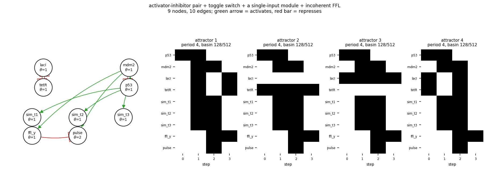

# size09_ai_toggle_sim_i1ffl

activator-inhibitor pair + toggle switch + a single-input module + incoherent FFL

9 nodes, 10 edges. Every function is a symmetric threshold function: it fires when at least `threshold` of its signed inputs agree (a `+` input agreeing means it is on, a `-` input agreeing means it is off).

## Functions

| node | function | threshold |
|---|---|---|
| `p53` | `NOT mdm2` | 1 |
| `mdm2` | `p53` | 1 |
| `lacI` | `NOT tetR` | 1 |
| `tetR` | `NOT lacI` | 1 |
| `sim_t1` | `p53` | 1 |
| `sim_t2` | `p53` | 1 |
| `sim_t3` | `p53` | 1 |
| `ffl_y` | `mdm2` | 1 |
| `pulse` | `mdm2 AND NOT ffl_y` | 2 |

## State space

All 512 states enumerated: 4 attractors (0 of them fixed points), mean 4.50 nodes change per step along them.

| attractor | period | basin | states (p53, mdm2, lacI, tetR, sim_t1, sim_t2, sim_t3, ffl_y, pulse) |
|---|---|---|---|
| 1 | 4 | 128/512 | 100000000 -> 111111100 -> 010011111 -> 001100010 |
| 2 | 4 | 128/512 | 100100000 -> 110111100 -> 010111111 -> 000100010 |
| 3 | 4 | 128/512 | 101000000 -> 111011100 -> 011011111 -> 001000010 |
| 4 | 4 | 128/512 | 101100000 -> 110011100 -> 011111111 -> 000000010 |

