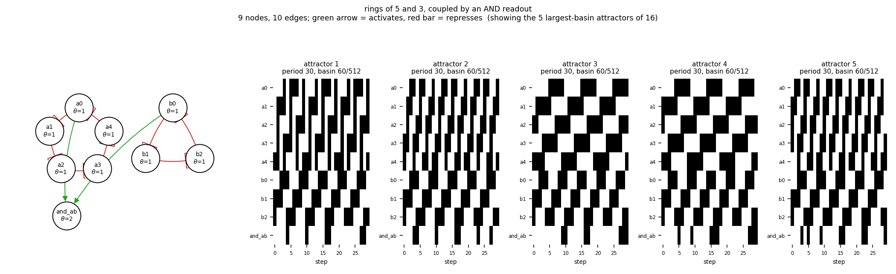

# size09_ring5_ring3_and

rings of 5 and 3, coupled by an AND readout

9 nodes, 10 edges. Every function is a symmetric threshold function: it fires when at least `threshold` of its signed inputs agree (a `+` input agreeing means it is on, a `-` input agreeing means it is off).

## Functions

| node | function | threshold |
|---|---|---|
| `a0` | `NOT a4` | 1 |
| `a1` | `NOT a0` | 1 |
| `a2` | `NOT a1` | 1 |
| `a3` | `NOT a2` | 1 |
| `a4` | `NOT a3` | 1 |
| `b0` | `NOT b2` | 1 |
| `b1` | `NOT b0` | 1 |
| `b2` | `NOT b1` | 1 |
| `and_ab` | `a0 AND b0` | 2 |

## State space

All 512 states enumerated: 16 attractors (0 of them fixed points), mean 4.38 nodes change per step along them.

| attractor | period | basin | states (a0, a1, a2, a3, a4, b0, b1, b2, and_ab) |
|---|---|---|---|
| 1 | 30 | 60/512 | 000010110 -> 011110100 -> 010001100 -> 110111000 -> 000101011 -> 111100010 -> 100000110 -> 101110100 -> 001001100 -> 111011000 -> ... |
| 2 | 30 | 60/512 | 000110110 -> 011100100 -> 110001100 -> 100111001 -> 001101011 -> 111000010 -> 100010110 -> 001110100 -> 011001100 -> 110011000 -> ... |
| 3 | 30 | 60/512 | 001010110 -> 011010100 -> 010011100 -> 010111000 -> 010101010 -> 110100010 -> 100100110 -> 101100100 -> 101001100 -> 101011001 -> ... |
| 4 | 30 | 60/512 | 011010110 -> 010010100 -> 010111100 -> 010101000 -> 110101010 -> 100100011 -> 101100110 -> 101000100 -> 101011100 -> 001011001 -> ... |
| 5 | 30 | 60/512 | 011100110 -> 110000100 -> 100111100 -> 001101001 -> 111001010 -> 100010011 -> 001110110 -> 011000100 -> 110011100 -> 000111001 -> ... |
| 6 | 30 | 60/512 | 011110110 -> 010000100 -> 110111100 -> 000101001 -> 111101010 -> 100000011 -> 101110110 -> 001000100 -> 111011100 -> 000011001 -> ... |
| 7 | 10 | 20/512 | 000011110 -> 011110000 -> 010001110 -> 110110000 -> 000101110 -> 111100000 -> 100001110 -> 101110001 -> 001001110 -> 111010000 |
| 8 | 10 | 20/512 | 000111110 -> 011100000 -> 110001110 -> 100110001 -> 001101110 -> 111000000 -> 100011110 -> 001110001 -> 011001110 -> 110010000 |
| 9 | 10 | 20/512 | 001011110 -> 011010000 -> 010011110 -> 010110000 -> 010101110 -> 110100000 -> 100101110 -> 101100001 -> 101001110 -> 101010001 |
| 10 | 10 | 20/512 | 011011110 -> 010010000 -> 010111110 -> 010100000 -> 110101110 -> 100100001 -> 101101110 -> 101000001 -> 101011110 -> 001010001 |
| 11 | 10 | 20/512 | 011101110 -> 110000000 -> 100111110 -> 001100001 -> 111001110 -> 100010001 -> 001111110 -> 011000000 -> 110011110 -> 000110001 |
| 12 | 10 | 20/512 | 011111110 -> 010000000 -> 110111110 -> 000100001 -> 111101110 -> 100000001 -> 101111110 -> 001000001 -> 111011110 -> 000010001 |
| 13 | 6 | 12/512 | 000000110 -> 111110100 -> 000001100 -> 111111000 -> 000001011 -> 111110010 |
| 14 | 6 | 12/512 | 111110110 -> 000000100 -> 111111100 -> 000001001 -> 111111010 -> 000000011 |
| 15 | 2 | 4/512 | 000001110 -> 111110000 |
| 16 | 2 | 4/512 | 111111110 -> 000000001 |

