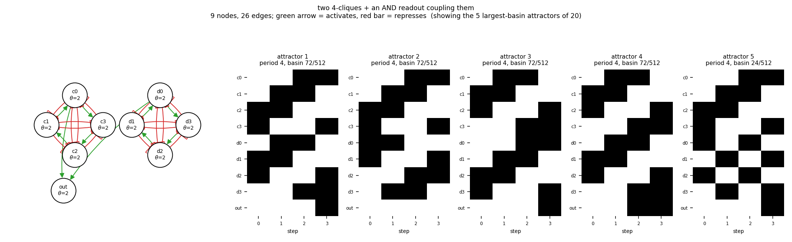

# size09_two_clique4_readout

two 4-cliques + an AND readout coupling them

9 nodes, 26 edges. Every function is a symmetric threshold function: it fires when at least `threshold` of its signed inputs agree (a `+` input agreeing means it is on, a `-` input agreeing means it is off).

## Functions

| node | function | threshold |
|---|---|---|
| `c0` | `at least 2 of (c1, NOT c2, NOT c3)` | 2 |
| `c1` | `at least 2 of (c2, NOT c3, NOT c0)` | 2 |
| `c2` | `at least 2 of (c3, NOT c0, NOT c1)` | 2 |
| `c3` | `at least 2 of (c0, NOT c1, NOT c2)` | 2 |
| `d0` | `at least 2 of (d1, NOT d2, NOT d3)` | 2 |
| `d1` | `at least 2 of (d2, NOT d3, NOT d0)` | 2 |
| `d2` | `at least 2 of (d3, NOT d0, NOT d1)` | 2 |
| `d3` | `at least 2 of (d0, NOT d1, NOT d2)` | 2 |
| `out` | `c0 AND d0` | 2 |

## State space

All 512 states enumerated: 20 attractors (0 of them fixed points), mean 6.47 nodes change per step along them.

| attractor | period | basin | states (c0, c1, c2, c3, d0, d1, d2, d3, out) |
|---|---|---|---|
| 1 | 4 | 72/512 | 001101100 -> 011011000 -> 110010010 -> 100100111 |
| 2 | 4 | 72/512 | 001111000 -> 011010010 -> 110000110 -> 100101100 |
| 3 | 4 | 72/512 | 011000110 -> 110001100 -> 100111000 -> 001110011 |
| 4 | 4 | 72/512 | 011001100 -> 110011000 -> 100110011 -> 001100111 |
| 5 | 4 | 24/512 | 001110100 -> 011001010 -> 110010100 -> 100101011 |
| 6 | 4 | 24/512 | 001111110 -> 011000000 -> 110011110 -> 100100001 |
| 7 | 4 | 24/512 | 011010100 -> 110001010 -> 100110100 -> 001101011 |
| 8 | 4 | 24/512 | 011011110 -> 110000000 -> 100111110 -> 001100001 |
| 9 | 4 | 24/512 | 101000110 -> 010101100 -> 101011000 -> 010110011 |
| 10 | 4 | 24/512 | 101001100 -> 010111000 -> 101010010 -> 010100111 |
| 11 | 4 | 24/512 | 111100110 -> 000001100 -> 111111000 -> 000010011 |
| 12 | 4 | 24/512 | 111101100 -> 000011000 -> 111110010 -> 000000111 |
| 13 | 2 | 4/512 | 000010100 -> 111101010 |
| 14 | 2 | 4/512 | 000011110 -> 111100000 |
| 15 | 2 | 4/512 | 010110100 -> 101001010 |
| 16 | 2 | 4/512 | 010111110 -> 101000000 |
| 17 | 2 | 4/512 | 101010100 -> 010101011 |
| 18 | 2 | 4/512 | 101011110 -> 010100001 |
| 19 | 2 | 4/512 | 111110100 -> 000001011 |
| 20 | 2 | 4/512 | 111111110 -> 000000001 |

