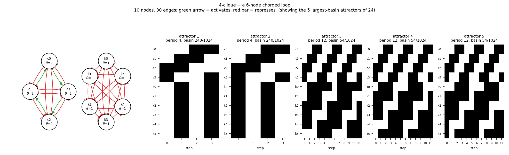

# size10_clique4_chorded6

4-clique + a 6-node chorded loop

10 nodes, 30 edges. Every function is a symmetric threshold function: it fires when at least `threshold` of its signed inputs agree (a `+` input agreeing means it is on, a `-` input agreeing means it is off).

## Functions

| node | function | threshold |
|---|---|---|
| `c0` | `at least 2 of (c1, NOT c2, NOT c3)` | 2 |
| `c1` | `at least 2 of (c2, NOT c3, NOT c0)` | 2 |
| `c2` | `at least 2 of (c3, NOT c0, NOT c1)` | 2 |
| `c3` | `at least 2 of (c0, NOT c1, NOT c2)` | 2 |
| `k0` | `NOT k5 OR NOT k4 OR NOT k3` | 1 |
| `k1` | `NOT k0 OR NOT k5 OR NOT k4` | 1 |
| `k2` | `NOT k1 OR NOT k0 OR NOT k5` | 1 |
| `k3` | `NOT k2 OR NOT k1 OR NOT k0` | 1 |
| `k4` | `NOT k3 OR NOT k2 OR NOT k1` | 1 |
| `k5` | `NOT k4 OR NOT k3 OR NOT k2` | 1 |

## State space

All 1024 states enumerated: 24 attractors (0 of them fixed points), mean 5.40 nodes change per step along them.

| attractor | period | basin | states (c0, c1, c2, c3, k0, k1, k2, k3, k4, k5) |
|---|---|---|---|
| 1 | 4 | 240/1024 | 0011000000 -> 0110111111 -> 1100000000 -> 1001111111 |
| 2 | 4 | 240/1024 | 0011111111 -> 0110000000 -> 1100111111 -> 1001000000 |
| 3 | 12 | 54/1024 | 0011001110 -> 0110111110 -> 1100111000 -> 1001111011 -> 0011100011 -> 0110101111 -> 1100001110 -> 1001111110 -> 0011111000 -> 0110111011 -> ... |
| 4 | 12 | 54/1024 | 0011011100 -> 0110111101 -> 1100110001 -> 1001110111 -> 0011000111 -> 0110011111 -> 1100011100 -> 1001111101 -> 0011110001 -> 0110110111 -> ... |
| 5 | 12 | 54/1024 | 0011011111 -> 0110011100 -> 1100111101 -> 1001110001 -> 0011110111 -> 0110000111 -> 1100011111 -> 1001011100 -> 0011111101 -> 0110110001 -> ... |
| 6 | 12 | 54/1024 | 0011111110 -> 0110111000 -> 1100111011 -> 1001100011 -> 0011101111 -> 0110001110 -> 1100111110 -> 1001111000 -> 0011111011 -> 0110100011 -> ... |
| 7 | 2 | 40/1024 | 0000000000 -> 1111111111 |
| 8 | 2 | 40/1024 | 0000111111 -> 1111000000 |
| 9 | 2 | 40/1024 | 0101000000 -> 1010111111 |
| 10 | 2 | 40/1024 | 0101111111 -> 1010000000 |
| 11 | 12 | 36/1024 | 0011011110 -> 0110111100 -> 1100111001 -> 1001110011 -> 0011100111 -> 0110001111 -> 1100011110 -> 1001111100 -> 0011111001 -> 0110110011 -> ... |
| 12 | 12 | 36/1024 | 0011111100 -> 0110111001 -> 1100110011 -> 1001100111 -> 0011001111 -> 0110011110 -> 1100111100 -> 1001111001 -> 0011110011 -> 0110100111 -> ... |
| 13 | 6 | 9/1024 | 0000000111 -> 1111011111 -> 0000011100 -> 1111111101 -> 0000110001 -> 1111110111 |
| 14 | 6 | 9/1024 | 0000001110 -> 1111111110 -> 0000111000 -> 1111111011 -> 0000100011 -> 1111101111 |
| 15 | 6 | 9/1024 | 0000011111 -> 1111011100 -> 0000111101 -> 1111110001 -> 0000110111 -> 1111000111 |
| 16 | 6 | 9/1024 | 0000101111 -> 1111001110 -> 0000111110 -> 1111111000 -> 0000111011 -> 1111100011 |
| 17 | 6 | 9/1024 | 0101000111 -> 1010011111 -> 0101011100 -> 1010111101 -> 0101110001 -> 1010110111 |
| 18 | 6 | 9/1024 | 0101001110 -> 1010111110 -> 0101111000 -> 1010111011 -> 0101100011 -> 1010101111 |
| 19 | 6 | 9/1024 | 0101011111 -> 1010011100 -> 0101111101 -> 1010110001 -> 0101110111 -> 1010000111 |
| 20 | 6 | 9/1024 | 0101101111 -> 1010001110 -> 0101111110 -> 1010111000 -> 0101111011 -> 1010100011 |
| 21 | 6 | 6/1024 | 0000001111 -> 1111011110 -> 0000111100 -> 1111111001 -> 0000110011 -> 1111100111 |
| 22 | 6 | 6/1024 | 0000011110 -> 1111111100 -> 0000111001 -> 1111110011 -> 0000100111 -> 1111001111 |
| 23 | 6 | 6/1024 | 0101001111 -> 1010011110 -> 0101111100 -> 1010111001 -> 0101110011 -> 1010100111 |
| 24 | 6 | 6/1024 | 0101011110 -> 1010111100 -> 0101111001 -> 1010110011 -> 0101100111 -> 1010001111 |

