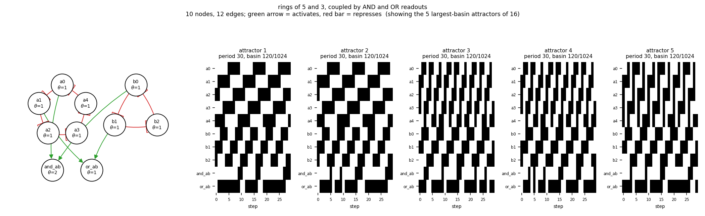

# size10_ring5_ring3_and_or

rings of 5 and 3, coupled by AND and OR readouts

10 nodes, 12 edges. Every function is a symmetric threshold function: it fires when at least `threshold` of its signed inputs agree (a `+` input agreeing means it is on, a `-` input agreeing means it is off).

## Functions

| node | function | threshold |
|---|---|---|
| `a0` | `NOT a4` | 1 |
| `a1` | `NOT a0` | 1 |
| `a2` | `NOT a1` | 1 |
| `a3` | `NOT a2` | 1 |
| `a4` | `NOT a3` | 1 |
| `b0` | `NOT b2` | 1 |
| `b1` | `NOT b0` | 1 |
| `b2` | `NOT b1` | 1 |
| `and_ab` | `a0 AND b0` | 2 |
| `or_ab` | `a1 OR b1` | 1 |

## State space

All 1024 states enumerated: 16 attractors (0 of them fixed points), mean 4.75 nodes change per step along them.

| attractor | period | basin | states (a0, a1, a2, a3, a4, b0, b1, b2, and_ab, or_ab) |
|---|---|---|---|
| 1 | 30 | 120/1024 | 0010101100 -> 0110101001 -> 0100111001 -> 0101110001 -> 0101010101 -> 1101000101 -> 1001001101 -> 1011001001 -> 1010011001 -> 1010110011 -> ... |
| 2 | 30 | 120/1024 | 0110101100 -> 0100101001 -> 0101111001 -> 0101010001 -> 1101010101 -> 1001000111 -> 1011001100 -> 1010001001 -> 1010111001 -> 0010110011 -> ... |
| 3 | 30 | 120/1024 | 0111001001 -> 1100011001 -> 1001110011 -> 0011010110 -> 1110000100 -> 1000101101 -> 0011101001 -> 0110011001 -> 1100110001 -> 0001110111 -> ... |
| 4 | 30 | 120/1024 | 0111001100 -> 1100001001 -> 1001111001 -> 0011010011 -> 1110010100 -> 1000100111 -> 0011101100 -> 0110001001 -> 1100111001 -> 0001110011 -> ... |
| 5 | 30 | 120/1024 | 0111101001 -> 0100011001 -> 1101110001 -> 0001010111 -> 1111000100 -> 1000001101 -> 1011101001 -> 0010011001 -> 1110110001 -> 0000110111 -> ... |
| 6 | 30 | 120/1024 | 0111101100 -> 0100001001 -> 1101111001 -> 0001010011 -> 1111010100 -> 1000000111 -> 1011101100 -> 0010001001 -> 1110111001 -> 0000110011 -> ... |
| 7 | 10 | 40/1024 | 0010111100 -> 0110100001 -> 0100111101 -> 0101100001 -> 0101011101 -> 1101000001 -> 1001011101 -> 1011000011 -> 1010011100 -> 1010100011 |
| 8 | 10 | 40/1024 | 0110111100 -> 0100100001 -> 0101111101 -> 0101000001 -> 1101011101 -> 1001000011 -> 1011011100 -> 1010000011 -> 1010111100 -> 0010100011 |
| 9 | 10 | 40/1024 | 0111000001 -> 1100011101 -> 1001100011 -> 0011011100 -> 1110000001 -> 1000111101 -> 0011100011 -> 0110011100 -> 1100100001 -> 0001111101 |
| 10 | 10 | 40/1024 | 0111011100 -> 1100000001 -> 1001111101 -> 0011000011 -> 1110011100 -> 1000100011 -> 0011111100 -> 0110000001 -> 1100111101 -> 0001100011 |
| 11 | 10 | 40/1024 | 0111100001 -> 0100011101 -> 1101100001 -> 0001011101 -> 1111000001 -> 1000011101 -> 1011100011 -> 0010011100 -> 1110100001 -> 0000111101 |
| 12 | 10 | 40/1024 | 0111111100 -> 0100000001 -> 1101111101 -> 0001000011 -> 1111011100 -> 1000000011 -> 1011111100 -> 0010000011 -> 1110111100 -> 0000100011 |
| 13 | 6 | 24/1024 | 1111101001 -> 0000011001 -> 1111110001 -> 0000010111 -> 1111100100 -> 0000001101 |
| 14 | 6 | 24/1024 | 1111101100 -> 0000001001 -> 1111111001 -> 0000010011 -> 1111110100 -> 0000000111 |
| 15 | 2 | 8/1024 | 1111100001 -> 0000011101 |
| 16 | 2 | 8/1024 | 1111111100 -> 0000000011 |

