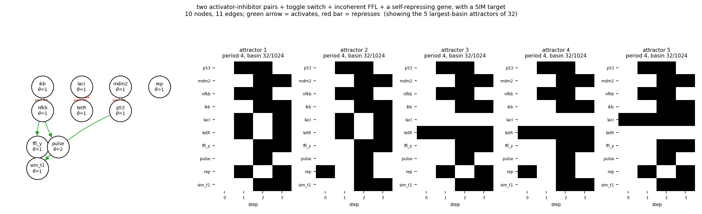

# size10_two_ai_toggle_i1ffl_nar

two activator-inhibitor pairs + toggle switch + incoherent FFL + a self-repressing gene, with a SIM target

10 nodes, 11 edges. Every function is a symmetric threshold function: it fires when at least `threshold` of its signed inputs agree (a `+` input agreeing means it is on, a `-` input agreeing means it is off).

## Functions

| node | function | threshold |
|---|---|---|
| `p53` | `NOT mdm2` | 1 |
| `mdm2` | `p53` | 1 |
| `nfkb` | `NOT ikb` | 1 |
| `ikb` | `nfkb` | 1 |
| `lacI` | `NOT tetR` | 1 |
| `tetR` | `NOT lacI` | 1 |
| `ffl_y` | `nfkb` | 1 |
| `pulse` | `nfkb AND NOT ffl_y` | 2 |
| `rep` | `NOT rep` | 1 |
| `sim_t1` | `p53` | 1 |

## State space

All 1024 states enumerated: 32 attractors (0 of them fixed points), mean 5.50 nodes change per step along them.

| attractor | period | basin | states (p53, mdm2, nfkb, ikb, lacI, tetR, ffl_y, pulse, rep, sim_t1) |
|---|---|---|---|
| 1 | 4 | 32/1024 | 0000000000 -> 1010110010 -> 1111001101 -> 0101111011 |
| 2 | 4 | 32/1024 | 0000000010 -> 1010110000 -> 1111001111 -> 0101111001 |
| 3 | 4 | 32/1024 | 0000010000 -> 1010010010 -> 1111011101 -> 0101011011 |
| 4 | 4 | 32/1024 | 0000010010 -> 1010010000 -> 1111011111 -> 0101011001 |
| 5 | 4 | 32/1024 | 0000100000 -> 1010100010 -> 1111101101 -> 0101101011 |
| 6 | 4 | 32/1024 | 0000100010 -> 1010100000 -> 1111101111 -> 0101101001 |
| 7 | 4 | 32/1024 | 0000110000 -> 1010000010 -> 1111111101 -> 0101001011 |
| 8 | 4 | 32/1024 | 0000110010 -> 1010000000 -> 1111111111 -> 0101001001 |
| 9 | 4 | 32/1024 | 0010000000 -> 1011111110 -> 1101001001 -> 0100110011 |
| 10 | 4 | 32/1024 | 0010000010 -> 1011111100 -> 1101001011 -> 0100110001 |
| 11 | 4 | 32/1024 | 0010010000 -> 1011011110 -> 1101011001 -> 0100010011 |
| 12 | 4 | 32/1024 | 0010010010 -> 1011011100 -> 1101011011 -> 0100010001 |
| 13 | 4 | 32/1024 | 0010100000 -> 1011101110 -> 1101101001 -> 0100100011 |
| 14 | 4 | 32/1024 | 0010100010 -> 1011101100 -> 1101101011 -> 0100100001 |
| 15 | 4 | 32/1024 | 0010110000 -> 1011001110 -> 1101111001 -> 0100000011 |
| 16 | 4 | 32/1024 | 0010110010 -> 1011001100 -> 1101111011 -> 0100000001 |
| 17 | 4 | 32/1024 | 1000000000 -> 1110110011 -> 0111001101 -> 0001111010 |
| 18 | 4 | 32/1024 | 1000000010 -> 1110110001 -> 0111001111 -> 0001111000 |
| 19 | 4 | 32/1024 | 1000010000 -> 1110010011 -> 0111011101 -> 0001011010 |
| 20 | 4 | 32/1024 | 1000010010 -> 1110010001 -> 0111011111 -> 0001011000 |
| 21 | 4 | 32/1024 | 1000100000 -> 1110100011 -> 0111101101 -> 0001101010 |
| 22 | 4 | 32/1024 | 1000100010 -> 1110100001 -> 0111101111 -> 0001101000 |
| 23 | 4 | 32/1024 | 1000110000 -> 1110000011 -> 0111111101 -> 0001001010 |
| 24 | 4 | 32/1024 | 1000110010 -> 1110000001 -> 0111111111 -> 0001001000 |
| 25 | 4 | 32/1024 | 1100000001 -> 0110110011 -> 0011001100 -> 1001111010 |
| 26 | 4 | 32/1024 | 1100000011 -> 0110110001 -> 0011001110 -> 1001111000 |
| 27 | 4 | 32/1024 | 1100010001 -> 0110010011 -> 0011011100 -> 1001011010 |
| 28 | 4 | 32/1024 | 1100010011 -> 0110010001 -> 0011011110 -> 1001011000 |
| 29 | 4 | 32/1024 | 1100100001 -> 0110100011 -> 0011101100 -> 1001101010 |
| 30 | 4 | 32/1024 | 1100100011 -> 0110100001 -> 0011101110 -> 1001101000 |
| 31 | 4 | 32/1024 | 1100110001 -> 0110000011 -> 0011111100 -> 1001001010 |
| 32 | 4 | 32/1024 | 1100110011 -> 0110000001 -> 0011111110 -> 1001001000 |

