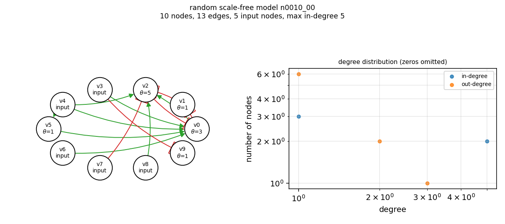

# n0010_00

A random scale-free model: topology from networkx's directed scale-free generator (seed 10000), with a uniformly random symmetric threshold function per non-input node - random signs, and a threshold drawn uniformly from [1, in-degree].

| property | value |
|---|---|
| nodes | 10 |
| edges | 13 |
| input nodes (in-degree 0) | 5 |
| mean in-degree | 1.30 |
| max in-degree | 5 |
| max out-degree | 3 |
| attractors (full enumeration) | 32 |
| attractor periods | 1, 5 |

Stored as `network.json` (signs + threshold per node) rather than truth tables, which would need 2**5 rows for this model's largest node.

