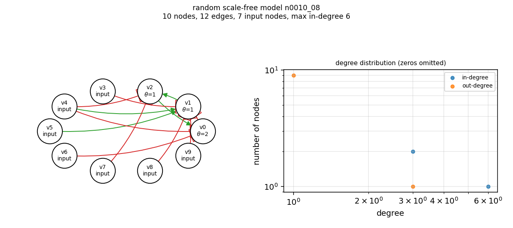

# n0010_08

A random scale-free model: topology from networkx's directed scale-free generator (seed 10008), with a uniformly random symmetric threshold function per non-input node - random signs, and a threshold drawn uniformly from [1, in-degree].

| property | value |
|---|---|
| nodes | 10 |
| edges | 12 |
| input nodes (in-degree 0) | 7 |
| mean in-degree | 1.20 |
| max in-degree | 6 |
| max out-degree | 3 |
| attractors (full enumeration) | 128 |
| attractor periods | 1 |

Stored as `network.json` (signs + threshold per node) rather than truth tables, which would need 2**6 rows for this model's largest node.

