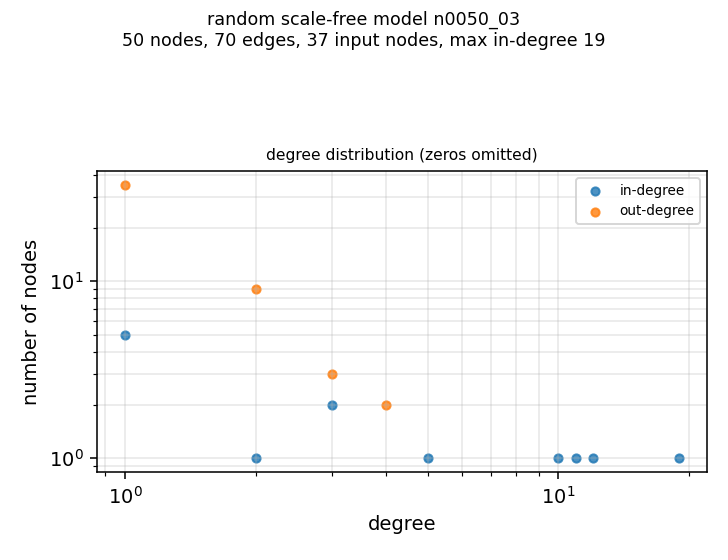

# n0050_03

A random scale-free model: topology from networkx's directed scale-free generator (seed 50003), with a uniformly random symmetric threshold function per non-input node - random signs, and a threshold drawn uniformly from [1, in-degree].

| property | value |
|---|---|
| nodes | 50 |
| edges | 70 |
| input nodes (in-degree 0) | 37 |
| mean in-degree | 1.40 |
| max in-degree | 19 |
| max out-degree | 4 |
| attractors | not enumerated (2**50 states) |

Stored as `network.json` (signs + threshold per node) rather than truth tables, which would need 2**19 rows for this model's largest node.

