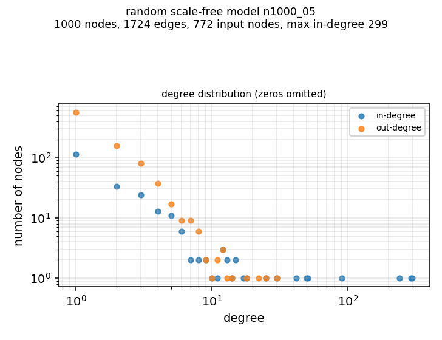

# n1000_05

A random scale-free model: topology from networkx's directed scale-free generator (seed 1000005), with a uniformly random symmetric threshold function per non-input node - random signs, and a threshold drawn uniformly from [1, in-degree].

| property | value |
|---|---|
| nodes | 1000 |
| edges | 1724 |
| input nodes (in-degree 0) | 772 |
| mean in-degree | 1.72 |
| max in-degree | 299 |
| max out-degree | 30 |
| attractors | not enumerated (2**1000 states) |

Stored as `network.json` (signs + threshold per node) rather than truth tables, which would need 2**299 rows for this model's largest node.

