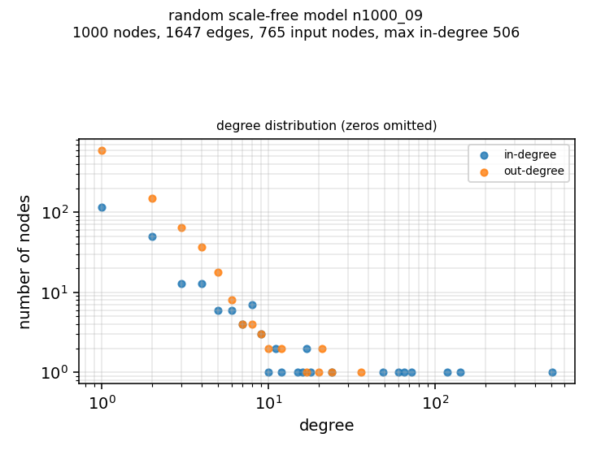

# n1000_09

A random scale-free model: topology from networkx's directed scale-free generator (seed 1000009), with a uniformly random symmetric threshold function per non-input node - random signs, and a threshold drawn uniformly from [1, in-degree].

| property | value |
|---|---|
| nodes | 1000 |
| edges | 1647 |
| input nodes (in-degree 0) | 765 |
| mean in-degree | 1.65 |
| max in-degree | 506 |
| max out-degree | 36 |
| attractors | not enumerated (2**1000 states) |

Stored as `network.json` (signs + threshold per node) rather than truth tables, which would need 2**506 rows for this model's largest node.

